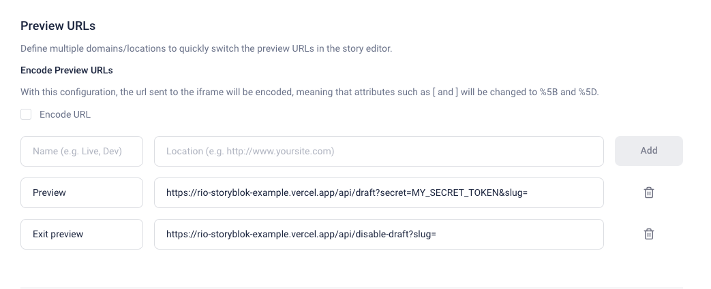

## Next.js app router with Storyblok and Redirection.io

Project demo demonstrating the setup of :

- Next.js app router and Draft mode
- Storyblok
- Redirection.io

## How to use it ?

1. Clone the repository
2. Create a `.env` file with the following variables :
   - `REDIRECTIONIO_TOKEN`
   - `NEXT_PUBLIC_STORYBLOK_ACCESS_TOKEN`
3. Run `yarn install`
4. Run `yarn dev`
5. Go to http://localhost:3000/

This app exposes two endpoints :

- `/api/draft` : enable draft mode
- `/api/disable-draft` : disable draft mode

## How to setup Redirection.io ?

1. Go to https://redirection.io/
2. Create an account
3. Create a new project
4. Get the API key
5. Set the API key in the `.env` file

## How to setup Storyblok ?

1. Go to https://app.storyblok.com/
2. Create an account
3. Create a new space
4. Get the access token
5. Set the access token in the `.env` file

Add the preview URLs in the settings of your project in Storyblok :

